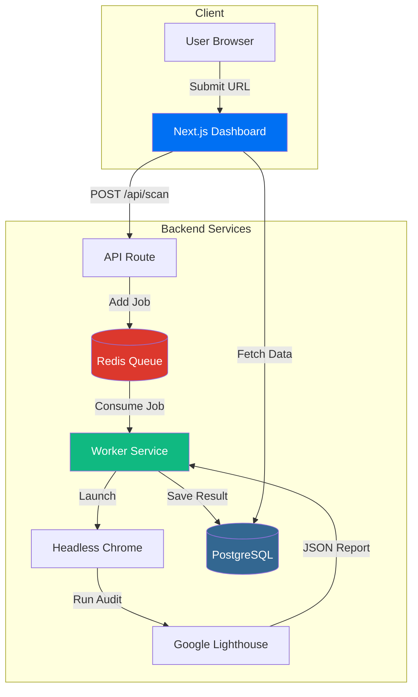

# Perf-Patrol 🚀

> Automated Google Lighthouse Audit Platform — A distributed system for continuous web performance monitoring.

[](LICENSE)
[](https://www.typescriptlang.org/)
[](https://nextjs.org/)
[](https://docs.docker.com/compose/)

---

## 🏗️ Architecture



## 📦 Tech Stack

| Layer         | Technology                            |
|---------------|---------------------------------------|
| **Frontend**  | Next.js 14, Tailwind CSS, shadcn/ui   |
| **API**       | Next.js App Router (Route Handlers)   |
| **Queue**     | BullMQ + Redis                        |
| **Worker**    | Node.js + Puppeteer + Lighthouse      |
| **Database**  | PostgreSQL + Prisma ORM               |
| **Infra**     | Docker Compose                        |

## 🚀 Quick Start

### Prerequisites

- **Node.js** >= 18
- **Docker** & **Docker Compose** (for Postgres + Redis)
- **Git**

### 1. Clone & Install

```bash
git clone https://github.com/YOUR_USERNAME/perf-patrol.git
cd perf-patrol
npm install
```

### 2. Start Infrastructure

```bash
docker compose up -d
```

This starts PostgreSQL and Redis containers.

### 3. Setup Database

```bash
npm run db:generate
npm run db:push
npm run db:seed
```

### 4. Run the App

```bash
# Terminal 1 — Web Dashboard
npm run dev

# Terminal 2 — Worker (optional, for processing scans)
npm run worker:dev
```

Open [http://localhost:3000](http://localhost:3000) to view the dashboard.

## 📁 Project Structure

```
perf-patrol/
├── apps/
│   └── web/                  # Next.js 14 Dashboard
│       ├── app/
│       │   ├── api/scan/     # REST API endpoints
│       │   ├── dashboard/    # Dashboard pages
│       │   └── layout.tsx    # Root layout
│       └── components/       # Reusable UI components
├── packages/
│   ├── database/             # Prisma schema & client
│   │   ├── prisma/
│   │   │   └── schema.prisma
│   │   ├── seed.ts
│   │   └── index.ts
│   └── worker/               # BullMQ audit worker
│       ├── src/index.ts
│       └── Dockerfile
├── docker-compose.yml
├── package.json
└── README.md
```

## 🤝 Contributing

We welcome contributions! Please see our [Contributing Guide](CONTRIBUTING.md) for details.

## 📄 License

This project is licensed under the MIT License — see the [LICENSE](LICENSE) file for details.
